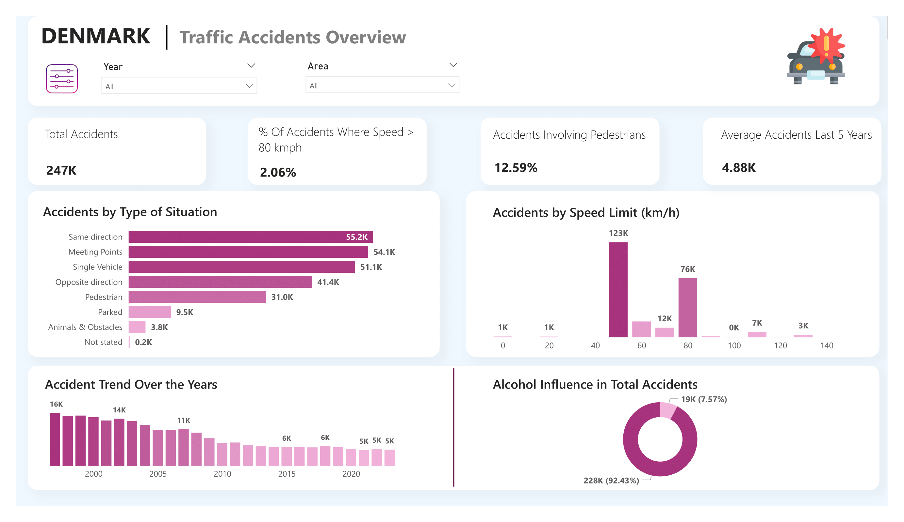

# 🚗 Denmark Traffic Accidents – Power BI Report

## 📌 Project Overview

This Power BI report explores real accident data from Denmark between **1997 and 2023** to uncover patterns in **road safety, crash types, pedestrian involvement**, and more.  
The goal is to turn raw numbers into clear, useful insights that can support smarter decisions and promote safer roads across the country.

---

## 🧰 Tools Used

- **Power BI Desktop** – for cleaning, modeling, and visualizing data  
- **Power Query Editor** – to clean and prepare the dataset  
- **DAX** – to calculate key performance metrics  

---

## 🔄 Process

### 1. Data Import  
- Downloaded accident data from **Statistics Denmark**  
- Imported it directly into **Power BI** for analysis

  📊 [Download Source Data](Data/Accidents_DK.xlsx)

### 2. Data Cleaning  
- Used **Power Query Editor** to clean and structure the dataset  
- Categorized accidents by type, speed, and area (urban vs. non-urban)

### 3. Power BI Modeling  
- Built custom measures with **DAX**, including:
  - % of accidents involving alcohol  
  - % involving pedestrians  
  - Accident breakdown by speed zones

### 4. Report Creation  
- Designed a fully interactive **Power BI Report**  
- Included filters for **year, area, speed, and accident type**  
- Easy to explore with clean visuals and time-based insights

  

  [Download Report (PDF)](Report/Traffic_Report.pdf)

  [Download Report (.pbix)]()

---

## 🔍 Insights

### 📈 Key Metrics  
- **Total Accidents**: 247,000+  
- **Years Covered**: 1997–2023  
- **Pedestrian-Related Accidents**: ~13%  
- **Alcohol-Involved Accidents**: ~7.5%

---

### 🏙️ Urban vs. Non-Urban  
- **Urban Accidents**: 41%  
- **Non-Urban Accidents**: 59%  
➡️ Most accidents occur outside cities — rural roads need more focus.

---

### ⚠️ Common Accident Types  
- **Same Direction Collisions**  
- **Single Vehicle Incidents**  
- **Meeting Point Crashes**  
➡️ These account for the majority and signal risk in daily driving patterns.

---

### 🚶‍♂️ Pedestrian Involvement  
- About **1 in 8** accidents involve pedestrians  
➡️ Highlights the importance of safer crosswalks and better signage.

---

### 🍷 Alcohol Impact  
- Roughly **7.5%** of accidents involve alcohol  
➡️ There’s still room for awareness and stronger safety efforts.

---

### 📊 Speed-Related Accidents  
- Only **2%** of crashes happened above **80 km/h**  
➡️ But these often have serious outcomes — speed still matters.

---

### 📅 Long-Term Trends  
- Accident numbers dropped significantly from 2000 to 2015  
- However, they’ve plateaued in recent years  
➡️ Time for fresh action and smarter policies to push improvement forward.

---

## 🚀 How to Use the Report

1. Open the `.pbix` file using **Power BI Desktop**  
   [Download Report (pbix)](Report/Traffic_Accidents.pbix)  
2. Refresh the data if needed  
3. Explore the visuals by filtering for **year, area, speed, and type**  
4. Use insights to inform safety planning and public awareness campaigns  

---

📫 [**Questions or feedback?** Let’s connect on LinkedIn!](https://www.linkedin.com/in/shehrozsarwar)
